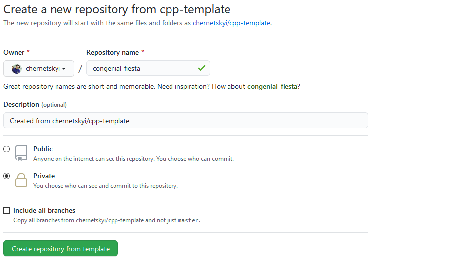
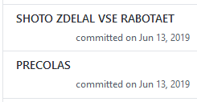
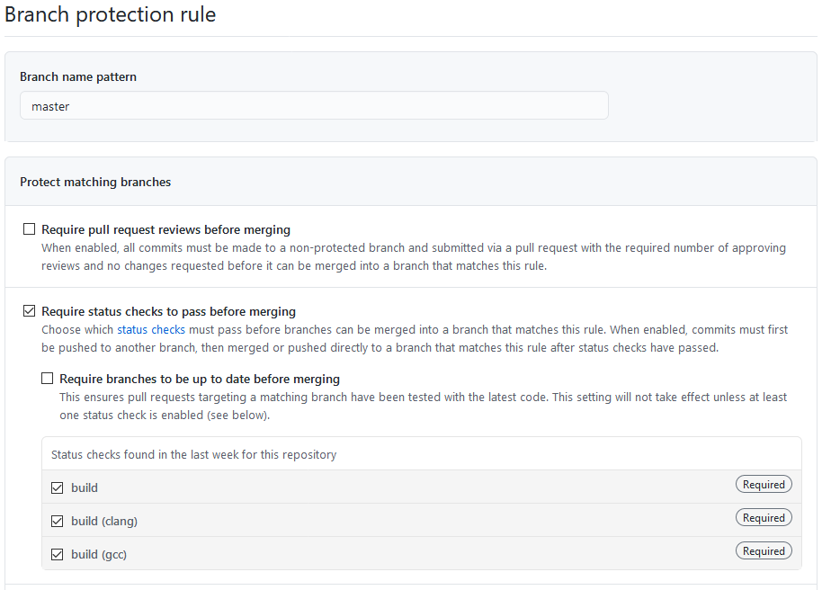
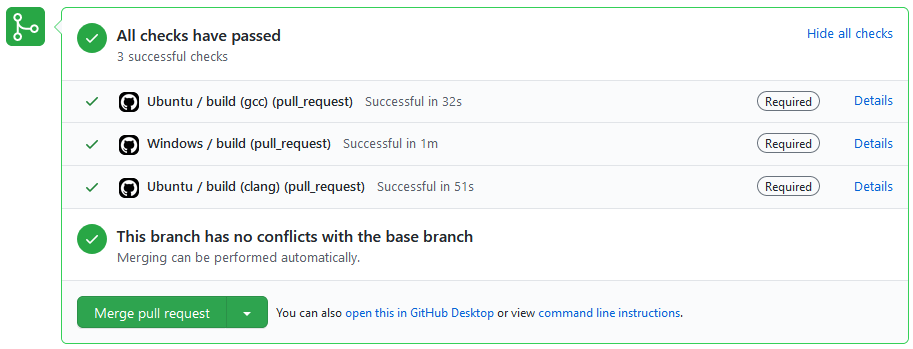

# Інструкції по використанню шаблону C++ проектів для студентів пана Олега Фаренюка

## TL;DR

1. [Згенерувати](https://github.com/chernetskyi/cpp-template/generate) репозиторій з шаблону
2. Склонувати собі свій репозиторій
3. Створити гілку для розробки і попрацювати над своїм проектом в ній
4. Коли нова ітерація проекту готова до релізу - зробити Pull Request в гілку `master`
5. Якщо GCC/Clang тести успішно пройдено - злити гілки

## Для тих, хто хоче розуміти, що і чому робить

- [Генеруємо репозиторій](#генеруємо-репозиторій)
  - [Приватний чи публічний?](#приватний-чи-публічний)
- [Робота над проектом](#робота-над-проектом)
  - [Зауваження](#зауваження)
  - [Один розробник](#один-розробник)
  - [Команда розробників](#команда-розробників)
  - [Рекомендовано: правила захисту гілок](#рекомендовано-правила-захисту-гілок)
- [Про шаблон](#про-шаблон)
  - [CMakeLists.txt](#cmakeliststxt)
    - [Опції](#опції)
  - [apt_packages.txt](#apt_packagestxt)
  - [conanfile.txt](#conanfiletxt)
  - [README.md](#readmemd)
  - [gitignore](#gitignore)
  - [.github/workflows](#githubworkflows)

### Генеруємо репозиторій

Заходимо на [сторінку свого улюбленого асистента](https://github.com/chernetskyi) і починаємо стежити за ним, щоб не пропустити жодних оновлень. Переходимо на [сторінку шаблонного репозиторію](https://github.com/chernetskyi/cpp-template) і ставимо зірочку, щоб було легше знайти в майбутньому. [Генеруємо репозиторій](https://github.com/chernetskyi/cpp-template/generate) для свого проекту.

Копіювати інші гілки, окрім `master`, немає потреби.

#### Приватний чи публічний?

Для боротьби з плагіатом репозиторій на час розробки проекту варто робити приватним. Видимість GitHub репозиторію (публічний/приватний) можна змінити в налаштуваннях репозиторію.

[Неперервна інтеграція](https://uk.wikipedia.org/wiki/Неперервна_інтеграція) в шаблоні базується на [GitHub Actions](https://github.com/features/actions). Для приватних репозиторіїв є обмеження на тривалість роботи GitHub Actions: 2000 хвилин в місяць для безкоштовних акаунтів, 3000 - для PRO. Якщо користуватись GitHub Actions лише для проектів на курсах пана Олега і працювати **розумно** - цих хвилин вистачає. Для публічних репозиторіїв обмежень на тривалість роботи GitHub Actions немає.

### Робота над проектом

Для того, щоб слово **Git** в резюме студентів щось означало, і для того, щоб студенти мали уявлення про процес розробки програмного забезпечення в дорослому світі, працювати з проектом варто (доведеться задля тестів) по одній із стратегій гілкування: популярній [Git Flow](https://nvie.com/posts/a-successful-git-branching-model/), простішій і тепер рекомендованій автором Git Flow [GitHub Flow](https://guides.github.com/introduction/flow/), чи рідкісній, проте ефективній [Trunk Based Development](https://trunkbaseddevelopment.com/). Пишіть [правильні](https://chris.beams.io/posts/git-commit/) повідомлення комітів, або хоча б без всіляких непристойностей: балів не зніматимемо, але асистентам і викладацькому складу буде весело.

#### Зауваження

1. В будь-який момент часу код гілки `master` повинен бути **робочим** - хоча б компільованим. **Робота перевірятиметься із гілки `master`.**
2. Для запуску тестів необхідно зробити Pull Request в `master`. Звісно, можна зробити PR `master`→`master`, але такі збочення не варто показувати людям.

Усі згадані вище і описані нижче стратегії гілкування задовільняють ці умови.

> Працюйте над своїми проектами як заманеться. Нижче лише рекомендації до процесу розробки за двома стратегіями гілкування, які пробував ваш улюблений асистент. Задля цікавого досвіду, при роботі в команді випробуйте Trunk Based Development.

#### Один розробник

Процес описаний нижче подібний до **GitHub  Flow**.

1. Клонуємо репозиторій.
2. Створюємо гілку розробки (`dev`/`develop`/`development`, але не `developer`) із гілки `master`: `git checkout -b development`.
3. Вносимо зміни.
4. Зберігаємо зміни віддалено, в `origin`: з `development` гілки `git push -u origin development`(після першого разу можна просто `git push`).
5. Коли, на думку студента, новий реліз проекту є готовим (локально відтестований), - створюємо Pull Request із гілки `development` в гілку `master`.
6. В разі успішного проходження всіх тестів - зливаємо гілки, в іншому разі - виправляємо, тести запускатимуться щоразу при push'і в гілку розробки, поки Pull Request відкритий.

#### Команда розробників

Процес описаний нижче подібний до **Git  Flow**.

1. Створюємо гілку розробки (`dev`/`develop`/`development`, але не `developer`) із гілки `master` у Web інтерфейсі GitHub на сторінці репозиторію, щоб уникнути зайвих конфліктів.
2. Клонуємо репозиторій.
3. Щоб розробка над проектом велась командою паралельно, а не послідовно, кожен член команди повинен створювати свою гілку (`feature/help-flag` чи `bug/nullptr-reference` для прикладу) з останньої версії гілки розробки: `git pull`, `git checkout development`, `git checkout -b feature/common-library`.
4. Вносимо зміни.
5. Зберігаємо зміни віддалено, в `origin`: з своєї гілки `git push -u origin feature/common-library`(після першого разу можна просто `git push`).
6. Коли, на думку студента, частина функціоналу, яку він реалізовував чи виправляв готова (локально відтестована), - створюємо Pull Request із своєї гілки в гілку розробки і зливаємо гілки.
7. Коли, на думку команди, новий реліз проекту є готовим (локально відтестований), - створюємо Pull Request із гілки `development` в гілку `master`.
8. В разі успішного проходження всіх тестів - зливаємо гілки, в іншому разі - виправляємо, тести запускатимуться щоразу при push'і в гілку розробки, поки Pull Request відкритий.

#### Рекомендовано: правила захисту гілок

Для "правильності", після першого Pull Request, налаштуємо правила захисту гілок. З їх допомогою можна заборонити злиття гілок, якщо не проходять тести. В налаштуваннях репозиторію, в розділі **Branches**, створюємо нове правило.

### Про шаблон

#### CMakeLists.txt

З метою приховання деталь, із [CMakeLists.txt](https://github.com/chernetskyi/cpp-template/blob/master/CMakeLists.txt) винесено директиви до директорії [cmake](https://github.com/chernetskyi/cpp-template/tree/master/cmake). Для зручності, в CMakeLists.txt залишено лише опції, директиви для компіляції проекту та налаштування санітайзерів.

##### Опції:

1. `WARNINGS_AS_ERRORS` - попередження компілятора сприйматимуться, як помилки. Рекомендована, проте не обов'язкова опція. В рідких випадках може руйнувати компіляцію правильного коду.
2. `ENABLE_SANITIZERS` - вмикає перевірку коду санітайзерами. Доступні санітайзери UB, пам'яті, адреси та потоків. На жаль, одночасно може працювати лише один з санітайзерів пам'яті, адреси та потоків. **При активації цієї опції потрібно додати CMake ціль до директиви `add_sanitizers()`.**
3. `ENABLE_CONAN` - активує використання пакетного менеджера С/C++ Conan. Потрібна лише при використанні сторонніх бібліотек (**окрім Boost**) при компіляції MSVC. Не впливає на компіляцію на Linux. Використовується разом із [conanfile.txt](#conanfiletxt).

#### apt_packages.txt

В [apt_packages.txt](https://github.com/chernetskyi/cpp-template/blob/master/apt_packages.txt) потрібно вказувати назви пакетів пакетного менеджеру apt, які необхідні для успішної компіляції вашого проекту, розділені новим рядком. Файл підтримує коментарі, тому пишіть їх.

> Зазвичай, якщо ви використовуєте CMake директиву `find_package()`, то потрібно додати запис в apt_packages.txt.

Навіть якщо ви не потребуєте жодних додаткових пакетів, **не видаляйте apt_packages.txt**, залиште його порожнім.  Навіть якщо ваш пакет є в середовищі GitHub Action ([cписок](https://github.com/actions/virtual-environments/blob/main/images/linux/Ubuntu2004-README.md)), вкажіть його в apt_packages.txt, його може не бути в того, хто перевіряє.

Не забудьте прибрати Boost.Program_options із apt_packages.txt, якщо не потребуєте його, - це прискорить тести.

#### conanfile.txt

Файл із інструкціями для пакетного менеджера C/C++ Conan. Використовує типовий синтаксис conanfile. Потрібен лише при активації опції `ENABLE_CONAN` в CMakeLists.txt (компіляція MSVC із будь-якими сторонніми бібліотеками, **окрім Boost**). Окрім репозиторіїв Conan, є підтримка репозиторіїв Bincrafters.

#### README.md

[README.md](https://github.com/chernetskyi/cpp-template/blob/master/README.md) є прикладом того, що від вас хоче бачити той, хто перевіряє. Допускаються README в довільному вигляді, проте на питання "як компілювати?", "як користуватись?", та "хто робив?" варто відповісти.

#### gitignore

[.gitignore](https://github.com/chernetskyi/cpp-template/blob/master/.gitignore) включає в себе велику кількість правил, щоб студенти не завантажували "сміття": артефакти компіляції, файли налаштування проекту в середовищі розробки та інше.

#### .github/workflows

[ubuntu.yml](https://github.com/chernetskyi/cpp-template/blob/master/.github/workflows/ubuntu.yml) та [windows.yml](https://github.com/chernetskyi/cpp-template/blob/master/.github/workflows/windows.yml) описують запуск GitHub Actions для неперервної інтеграції. На даний момент, тестується компільованість проекту на компіляторах g++, clang++ та MSVC. Тести запускаються паралельно.

## Зворотній зв'язок

Будь-які коментарі по шаблону пишіть автору ([вашому улюбленому асистенту](https://github.com/chernetskyi)) особисто. Пропозиції по реалізації нового функціоналу чи bug report'и залишайте в [issues](https://github.com/chernetskyi/cpp-template/issues).
